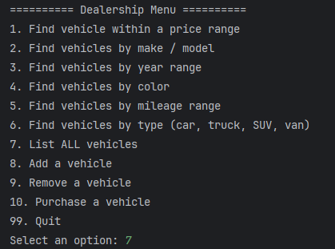
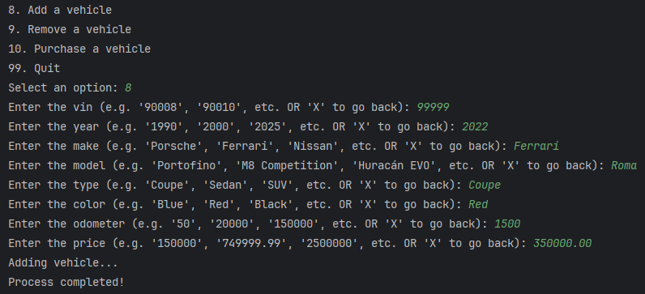
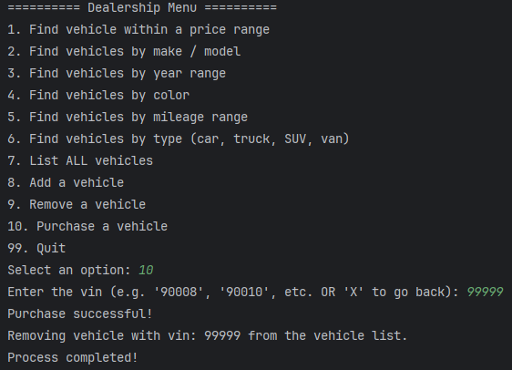
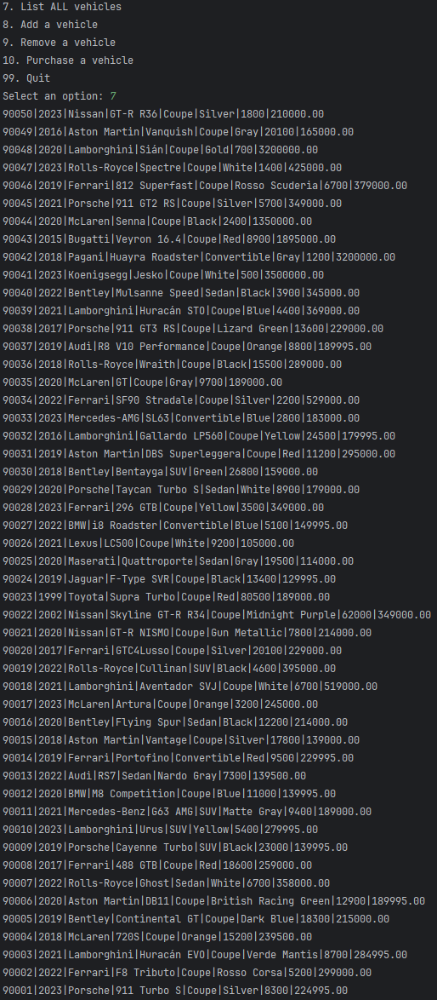
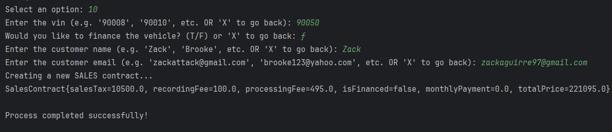

# 🚗 Dealership Management System
```
A simple Java console application for managing vehicle inventory and customer interactions at a dealership.  
The system allows users to view, add, remove, and purchase vehicles, with data saved and loaded from files.
```
---

## 📋 Features
```
- View all vehicles currently in the dealership’s inventory  
- Filter vehicles by make, model, price range, or type  
- Search for a vehicle by VIN  
- Add new vehicles to the inventory  
- Remove or purchase vehicles  
- Save and load dealership data  
- User-friendly command-line interface  
```
---

## 🧠 How It Works
```
The app uses a text-based menu to navigate different operations.  
Dealership data is stored locally and can be saved or loaded using the `DealershipFileManager` class.

**Core Classes:**
- `Dealership` – Stores the list of vehicles and provides methods to manage them  
- `Vehicle` – Represents an individual car with properties like VIN, make, model, price, and year  
- `DealershipFileManager` – Handles file input/output  
- `UserInterface` – Provides menu options and user interaction logic  
```
---

## 📂 Project Structure

```
DealershipManagementSystem/
│
├── src/
│   ├── com/dealership/
│   │   ├── Main.java
│   │   ├── Dealership.java
│   │   ├── Vehicle.java
│   │   ├── DealershipFileManager.java
│   │   ├── UserInterface.java
│
├── resources/
│   ├── dealership-data.txt
│   ├── screenshots/
│
└── README.md
```

---

## 🖼️ Screenshots

```
```
- **Main Menu:**  
  

- **Add Vehicle:**  
  

- **Purchase Vehicle:**  
  

- **View All Vehicles:**  
  
```
```
---

## 💾 Data Persistence
```
Vehicle data is saved to a local file using the `DealershipFileManager` class.  
When the app starts, it loads the data automatically from the file (if available).
```
---

## 🔧 Technologies Used
```
- **Language:** Java  
- **Version Control:** Git  
- **IDE:** IntelliJ IDEA / VS Code / Eclipse  
```
---

## 👨‍💻 Author
```
**Zackery Aguirre**  
Year Up Software Track – Application Development  
```


```markdown```
# 🚗 Dealership Management System
```

A Java console application for managing vehicle inventory, sales, leases, and customer interactions at a dealership.
The system allows users to view, add, remove, purchase, and lease vehicles, manage contracts, and handle vehicle returns.
Data is saved and loaded from files.

```
---

## 📋 Features
```

* View all vehicles currently in the dealership’s inventory
* Filter vehicles by make, model, year, color, price range, or type
* Search for a vehicle by VIN
* Add new vehicles to the inventory
* Remove, purchase, or lease vehicles
* Process vehicle returns and terminate contracts
* Track and manage sales and lease contracts
* Automatically calculate sales tax, fees, and monthly payments for financed vehicles
* Save and load dealership and contract data
* User-friendly command-line interface

```
---

## 🧠 How It Works
```

The app uses a text-based menu to navigate different operations.
Dealership and contract data are stored locally and managed via file manager classes.

**Core Classes:**

* `Dealership` – Stores the list of vehicles and provides methods to manage them
* `Vehicle` – Represents an individual car with properties like VIN, make, model, price, year, type, and color
* `Contract` – Base class containing customer and vehicle information, extended by sales and lease contracts
* `SalesContract` / `LeaseContract` – Handles contract-specific details including taxes, fees, financing, and monthly payments
* `ContractDataManager` – Manages contracts in memory and provides search functionality
* `DealershipFileManager` / `ContractFileManager` – Handles reading/writing dealership and contract data to files
* `UserInterface` – Provides menu options and user interaction logic

```
---

## 📂 Project Structure
```

DealershipManagementSystem/
│
├── src/
│   ├── com/dealership/
│   │   ├── Main.java
│   │   ├── Dealership.java
│   │   ├── Vehicle.java
│   │   ├── DealershipFileManager.java
│   │   ├── UserInterface.java
│   │   ├── contracts/
│   │       ├── Contract.java
│   │       ├── SalesContract.java
│   │       ├── LeaseContract.java
│   │       ├── ContractDataManager.java
│   │       ├── ContractFileManager.java
│
├── resources/
│   ├── dealership-data.txt
│   ├── contracts-data.txt
│   ├── screenshots/
│
└── README.md

```
---

## 🖼️ Screenshots
```
```

* **Main Menu:**
  

* **Add Vehicle:**
  

* **Purchase Vehicle:**
  

* **View All Vehicles:**
  

* **Return Vehicle / Terminate Contract:**
  

* **Lease Vehicle:**
  

```
```
---

## 💾 Data Persistence
```

Vehicle and contract data are saved to local files using `DealershipFileManager` and `ContractFileManager`.
Contracts include both sales and lease details.
Financed vehicles automatically calculate total cost including interest, taxes, and fees.
Data is loaded automatically on application start.

```
---

## 🔧 Technologies Used
```

* **Language:** Java
* **Version Control:** Git
* **IDE:** IntelliJ IDEA / VS Code / Eclipse

```
---

## 👨‍💻 Author
```

**Zackery Aguirre**
Year Up Software Track – Application Development

```